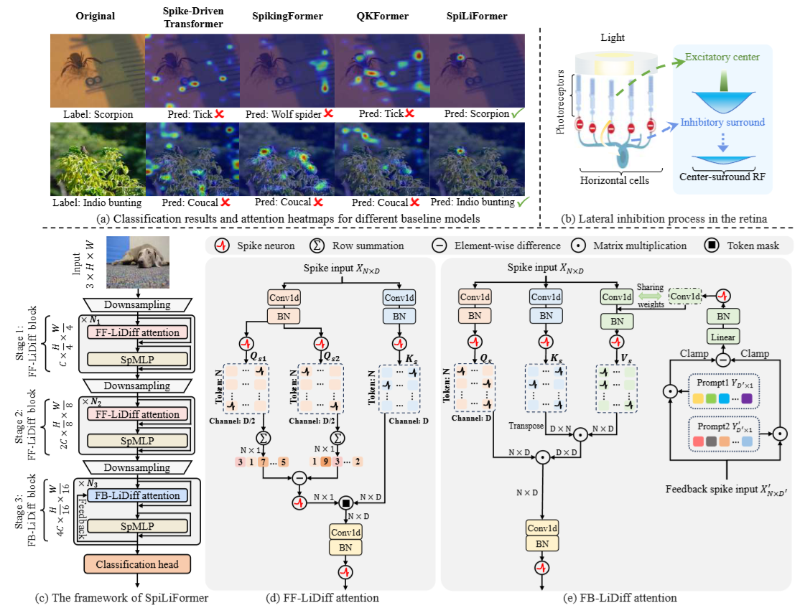

<div align="center" style="font-family: charter;">
<h1>SpiLiFormer: Enhancing Spiking Transformers with Lateral Inhibition</h1>
<a href="https://arxiv.org/pdf/2503.15986" target="_blank">
    
</a>
<a href="https://openreview.net/attachment?id=M4DTKg3PNr&name=supplementary_material" target="_blank">
    
</a>

<div>
    Zeqi Zheng*<sup></sup>,</span>
    Yanchen Huang*<sup></sup>,</span>
    Yingchao Yu<sup></sup>,</span>
    Zizheng Zhu<sup></sup>,</span>
    Junfeng Tang<sup></sup>,</span>
    Zhaofei Yu<sup></sup>,</span>
    Yaochu Jin<sup>&dagger;</sup></span>
</div>

<div>
    * Equal contribution <sup>&dagger;</sup> Corresponding author&emsp;
</div>

</div>

## News
* `Jun. 28, 2025` Our work has been accepted by [ICCV 2025](https://iccv.thecvf.com/) 🎉.

## Overview
SpiLiFormer (Spiking Transformer with Lateral Inhibition) is a novel brain-inspired spiking transformer architecture designed to enhance the performance and robustness of spiking neural networks (SNNs). 

Inspired by the lateral inhibition mechanism in the human visual system—which helps the brain focus on salient regions by suppressing responses from neighboring neurons—SpiLiFormer introduces two new attention modules:

- FF-LiDiff Attention (Feedforward-pathway Lateral Differential Inhibition): Inspired by short-range inhibition in the retina, this module reduces distraction in shallow network stages by differentially inhibiting attention responses.

- FB-LiDiff Attention (Feedback-pathway Lateral Differential Inhibition): Inspired by long-range cortical inhibition, this module incorporates feedback to refine attention allocation in deeper network stages.



## TODO
- [ ] Release the checkpoint of our models
- [ ] Release the code of our work

## Citation
If you use our code or data in this repo or find our work helpful, please consider giving a citation:

``` bibtex
@misc{zheng2025spiliformerenhancingspikingtransformers,
      title={SpiLiFormer: Enhancing Spiking Transformers with Lateral Inhibition}, 
      author={Zeqi Zheng and Yanchen Huang and Yingchao Yu and Zizheng Zhu and Junfeng Tang and Zhaofei Yu and Yaochu Jin},
      year={2025},
      eprint={2503.15986},
      archivePrefix={arXiv},
      primaryClass={cs.NE},
      url={https://arxiv.org/abs/2503.15986}, 
}
